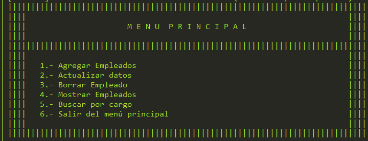

# Gestión de Empleados - Prueba Técnica

## Descripción
El objetivo de este proyecto, es evaluar tus conocimientos en Java, incluyendo sintaxis, estructuras repetitivas, estructuras selectivas, manejo de colecciones y operaciones CRUD (Crear, Leer, Actualizar y Borrar)
utilizando JPA (Java Persistence API) para interactuar con una base de datos.

## Requisitos
- Java 17 o superior
- JPA (Java Persistence API) para la interacción con la base de datos
- MySQL o cualquier base de datos compatible con JPA
- Un IDE para desarrollar el código (se recomienda IntelliJ IDEA o Eclipse)

### Requisitos de software:
- JDK 17
- MySQL (o base de datos similar)

- ## Instalación
1. Clona este repositorio:  https://github.com/JJPalomino/palominoJuanJose_pruebatec1.git
2. Navega al directorio del proyecto: palominoJuanJose_pruebatec1
3. Importa el proyecto en tu IDE preferido (IntelliJ IDEA, Eclipse, etc.).
4. Configura la conexión a la base de datos. Asegúrate de que el archivo `persistence.xml` tenga la configuración correcta para la base de datos `empleados`.
5. Crea la base de datos `empleados` usando el archivo SQL proporcionado (ver más abajo).
6. Ejecuta el proyecto y prueba las funcionalidades a través del menú interactivo en consola.

7. ## Uso
Al ejecutar la aplicación, se presentará un menú en consola donde podrás seleccionar las opciones para realizar las operaciones CRUD:

